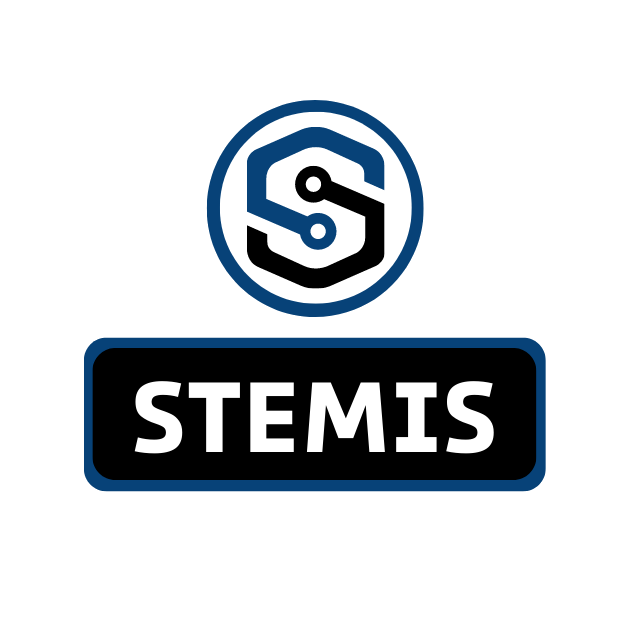

# STEMIS - Integração de API com Front-end



Instruções para o desafio de integração da API em flask com o front-end em Vue.js.

---

## Índice

1. [GitHub](#1-github)
   1. [Criar Conta](#11-criar-conta)
   2. [GitHub Desktop](#12-github-desktop)
   3. [Fork do Repositório](#13-fork-do-repositório)
2. [Docker](#2-docker)
   1. [Instalando o Docker](#21-instalando-o-docker)
   2. [Build](#22-build)
      1. [Back-end](#221-back-end)
      2. [Front-end](#222-front-end)
   3. [Run](#23-run)
   4. [Visualizar Containers em Execução](#24-visualizar-containers-em-execução)
3. [Desafio](#3-desafio)
4. [Finalizando](#4-finalizando)
   1. [Commit](#41-commit)
   2. [Pull Request](#42-pull-request)

---

## 1. GitHub

O [GitHub](https://github.com) é uma plataforma de hospedagem de código fonte e arquivos com controle de versão. Ele permite que programadores, utilitários ou qualquer usuário cadastrado na plataforma contribuam em projetos ao redor do mundo.

### 1.1 Criar Conta

O primeiro passo é a criação de uma conta no GitHub, para facilitar o acesso aos códigos e o versionamento das alterações.

Isso pode ser feito clicando em [Sign Up](https://github.com/signup?ref_cta=Sign+up&ref_loc=header+logged+out&ref_page=%2F&source=header-home).

### 1.2 GitHub Desktop

Uma forma interessante de trabalhar com GitHub é atraves do [GitHub Desktop](https://docs.github.com/pt/desktop), uma interface gráfica que auxilia na gestão dos repositórios.

A alternativa ao uso do GitHub Desktop é a instalação do comando [Git](https://docs.github.com/pt/get-started/using-git/about-git) no seu computador e trabalhar os passos a seguir executando comandos no terminal.

Não se esqueça de sempre que tiver dúvidas buscar uma solução na [documentação oficial do GitHub](https://docs.github.com/pt).

### 1.3 Fork do Repositório

Em engenharia de software, um fork ou bifurcação acontece quando um desenvolvedor inicia um projeto independente com base no código de um projeto já existente, ou seja, quando um software é desenvolvido com base em outro, já existente, sem a descontinuidade deste último.

Para fazer um fork e clonar o repositório basta seguir o [tutorial](https://docs.github.com/pt/desktop/contributing-and-collaborating-using-github-desktop/adding-and-cloning-repositories/cloning-and-forking-repositories-from-github-desktop).

---

## 2. Docker

O [Docker](https://www.docker.com/) é uma plataforma open source que facilita a criação e administração de ambientes isolados. Ele possibilita o empacotamento de uma aplicação ou ambiente dentro de um container, se tornando portátil para qualquer outro host que contenha o Docker instalado. Então, você consegue criar, implantar, copiar e migrar de um ambiente para outro com maior flexibilidade. A ideia do Docker é subir apenas uma máquina, ao invés de várias. E, nessa única máquina, você pode rodar várias aplicações sem que haja conflitos entre elas.

Com o uso do Docker podemos disponibilizar containers para que possam rodar as aplicações. Dessa forma é possível executar sem a necessidade de instalar as bibliotecas e pacotes necessários para a execução do sistema. Basta a instalação do Docker para a execução dos containers. Facilitando assim a escalabilidade do sistema, a adição de novos programadores na equipe e corrigir o famoso problema de "mas no meu computador está rodando".

### 2.1 Instalando o Docker

Para Windows e Mac é necessária a instalação de um software chamado [Docker Desktop](https://docs.docker.com/desktop/install/windows-install/), com ele virá a possibilidade também de rodar Docker no terminal, que é onde aplicaremos a maioria dos comandos daqui pra frente.

Para usuários de Linux é recomendada a instalação do [Docker Engine](https://docs.docker.com/engine/install/), a versão escolhida sera baseada na distribuição. Dessa forma teremos o Docker disponivel para execução de comandos via terminal. Também será necessária a instalação do [Docker Compose](https://docs.docker.com/compose/install/), uma ferramenta para a orquestração de múltiplos containers.

### 2.2 Build

O comando docker build constrói uma imagem a partir de um Dockerfile e de um contexto. O contexto do build é o conjunto de arquivos na localização especificada `PATH`. O `PATH` é o diretório no seu sistema de arquivos local.

#### 2.2.1 Back-end

#### 2.2.1.1 API

Com o diretório do `./Backend/API/` aberto do terminal, para costruir o container da API basta executar o seguinte comando.

```
docker build ./ -t flask_api
```


#### 2.2.1.1 Base de dados

Com o diretório do `./Backend/DB/` aberto do terminal, para costruir o container da API basta executar o seguinte comando.

```
docker build ./ -t mysql_db
```


#### 2.2.2 Front-end

Com o diretório do `./Frontend/` aberto do terminal, para costruir o container da API basta executar o seguinte comando.docker build

```
docker build ./ -t my_vue
```


### 2.3 Run

A execução dos containers será executada utilizando a ferramenta docker-compose. Uma ferramenta para a orquestração de múltiplos containers.

Para executar os containers, volte a pasta raiz do repositório e execute o seguinte comando.

```
docker-compose up
```

Para verificar se o container do back-end está rodando corretamente, acesse no seu navegador:

```
localhost:5000/
```

Para verificar se o container do front-end está rodando corretamente, acesse no seu navegador:

```
localhost:8080/
```

Para interromper os containers basta utilizar o atalho `CTRL+C` no terminal.

Para encerrar os containers basta executar o comando abaixo.

```
docker-compose down
```

### 2.4 Visualizar containers em execução

Para ver uma lista com os containers em execução, basta executar o seguinte comando no terminal:

```
docker ps
```

Para ver uma lista com todos os containers:

```
docker ps -a
```

---

## 3. Desafio

O nosso repositório consiste em um sistema web completo para cadastro de hoteis. O sistema é capaz de acessar um banco de dados SQL através de uma API  RESTful usando a biblioteca Flask do Python. Essa API é responsável por fazer as ações de CRUD (Create, Read, Update e Delete) dos registros de hotel no nosso banco de dados. O front-end da aplicação é construído em Vue.js, onde o usuário é capaz de preencher um formulário cadastrando hoteis no banco de dados.

O desafio consiste na seguinte tarefa: 

 - **Substituir o sistema de cadastro de hoteis para um sistema de cadastro de pacientes.**

O sistema deverá conter a API em Flask acessando o banco de dados e um front-end em Vue.js capaz de interagir com os dados executando o cadastro de um novo paciente. No cadastro de um paciente deverá conter as seguintes informações:

| **Campo**                      | **Tipo de Entrada** | **Exemplo**       | **Observação**                                                                   |
|--------------------------------|---------------------|-------------------|----------------------------------------------------------------------------------|
| Nome do Paciente               | string              | José da Silva     |                                                                                  |
| CPF                            | string              | 111.222.333-44    |                                                                                  |
| Data de Nascimento             | date                | 01/01/1990        |                                                                                  |
| Tipo Sanguineo                 | string              | A+                |                                                                                  |
| Peso                           | number              | 75kg              |                                                                                  |
| Intestino Delgado Remanescente | number              | 10cm              |                                                                                  |
| Valvula Ileocecal              | boolean             | True              |                                                                                  |
| Estomia                        | string              | Traqueostomia     | Opções entre [Colostomia, Ileostomia, Urostomia, Gastrostomia ou Traqueostomia]  |
| Segmento de Colon Remanescente | string              | Transverso        | Opções entre [Ascendente, Transverso, Descendente, Sigmoide ou Reto]             |
| Outra complicações             | string              | Arritmia cardíaca |                                                                                  |

Caso ainda exista alguma dúvida, o veja o [vídeo de explicação do desafio]().

---

## 4. Finalizando

Após o desafio finalizado, basta subir suas alterações ao seu repositório do GitHub e fazer uma solicitação de pull com suas alterações para o nosso repositório original.

### 4.1 Commit

À medida que você edita os arquivos, o GitHub Desktop monitora todas as alterações feitas. É possível decidir como você pretende agrupar as alterações para criar commits relevantes.

Ao fazer um commit, você deve incluir uma mensagem que descreva brevemente as alterações. Você também pode adicionar um coautor em qualquer commit em que colaborar.

Para efetuar um commit com suas alterações basta seguir o [tutorial](https://docs.github.com/pt/desktop/contributing-and-collaborating-using-github-desktop/making-changes-in-a-branch/committing-and-reviewing-changes-to-your-project).

### 4.2 Pull Request

É possível criar uma pull request para propor alterações que você fez em um fork de um repositório upstream. Para isso basta seguir o [tutorial](https://docs.github.com/pt/pull-requests/collaborating-with-pull-requests/proposing-changes-to-your-work-with-pull-requests/creating-a-pull-request-from-a-fork).

Pronto, o desafio esta finalizado, agora nós vamos avaliar a execução e te daremos uma resposta em breve.

Muito obrigado por participar!

Qualquer dúvida, estamos a disposição.
